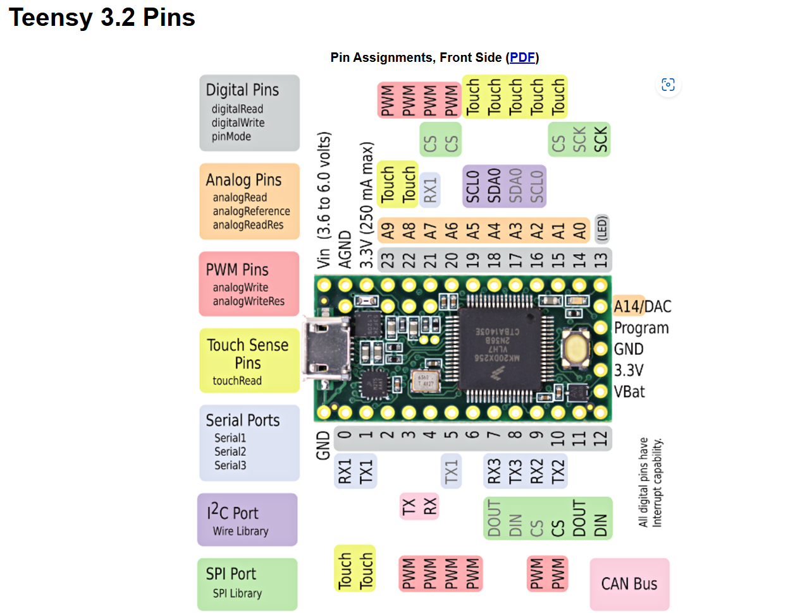
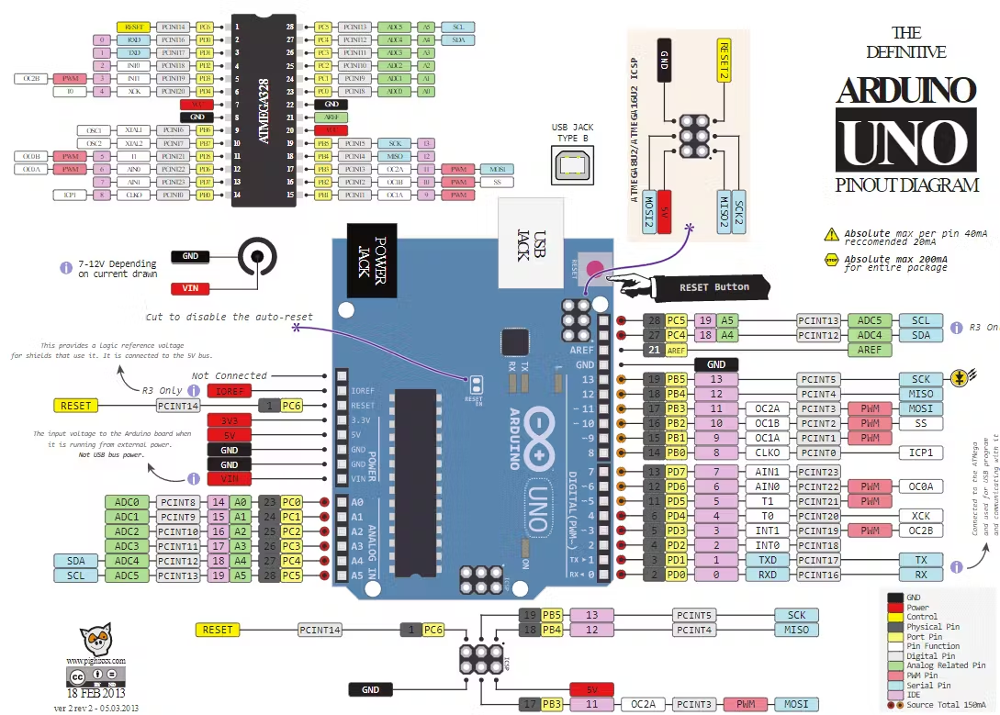
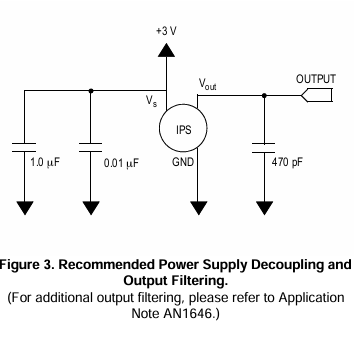
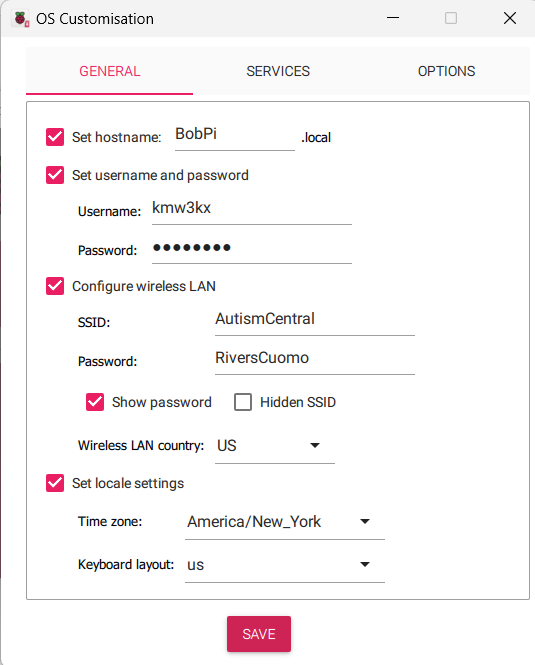

# Electronic Valve Instrument (EVI)

## Goal
Make an EVI-style wind controller w/ an onboard synthesizer

Using:
- [MP3V5004GP Pressure Sensor](https://www.digikey.com/en/products/detail/nxp-usa-inc/MP3V5004GP/2186181)
- [Capacitive Touch Sensor](https://www.digikey.com/en/products/detail/adafruit-industries-llc/1982/4990787)
- Raspberry Pi Zero W + ProtoBonnet Prototyping Board
- Arduino Uno
- SSD1306 OLED Display
- LSM303DLHC Compass+Accel
- 5-pin Female Adaptor 
- [6N138 Optocoupler](https://www.alldatasheet.com/datasheet-pdf/pdf/50077/FAIRCHILD/6N138.html)
- 3.7V 150mAh Rechargable Li Battery
- PowerBoost 500 Charger TPS61090 DC Boost
- MPL3115A2 Altimeter
- Other Basic Electronics (Buttons, Pots, Breadboard, Capacitors)
- Prototyping elements made from 3D Printing & Lasercutting
- Misc. Hardware

## Rough Sketches

## Wiring
After finding the NuEVI repo, I'm gonna start with the wiring so that I can map out what components I need.

>Place your third party libraries in a separate repository and use submodules to associate them with the main project. Here is a walk-through: Git Tools - Submodules (Pro Git book, 2nd.)

Thank you [random stackoverflow guy](https://stackoverflow.com/a/1871311)!
Imma do that.

### 12/2/24

Mainly just getting things set up in the repo. Have a presentation to give on this tomorrow, so I might lowkey just pull
this repo up.

I'm using Tinkercad for the wiring diagram. Very convenient that it already has an Arduino UNO + IDE included, so I can 
use it to start adjusting the code accordingly. Also good for mapping out all of the electronics I'll need. 

Here's the pinout for the Teensy 3.1/3.2 which the code is originally written for:

[*link*](https://www.pjrc.com/teensy/pinout.html)
What is ***REALLY*** nice is that all of the hardware mapping seems to be done by a single file (hopefully): `hardware.h`

So, all I gotta do is mess with this file.
Microsoft Copilot helped me with this one. Here's what it gave me:
<blockquote>
Got it! Let's reassign the pins from the Teensy 3.1 to the Arduino Uno. Here's a mapping for the pins you provided:

### Teensy 3.1 to Arduino Uno Pin Mapping

#### Capacitive Sensor Pins
- `bitePin` (Teensy 17) -> Arduino doesn't have a direct equivalent, consider using a digital pin like 7.
- `extraPin` (Teensy 16) -> Arduino digital pin 8.
- `pbUpPin` (Teensy 1) -> Arduino digital pin 2.
- `pbDnPin` (Teensy 0) -> Arduino digital pin 3.
- `vibratoPin` (Teensy 15) -> Arduino digital pin 4.

#### Analog Pressure Sensors
- `breathSensorPin` (Teensy A0) -> Arduino A0.
- `bitePressurePin` (Teensy A7) -> Arduino A1 (since Arduino Uno has A0-A5).

#### Digital Pins for Menu Buttons
- `dPin` (Teensy 3) -> Arduino digital pin 5.
- `ePin` (Teensy 4) -> Arduino digital pin 6.
- `uPin` (Teensy 5) -> Arduino digital pin 9.
- `mPin` (Teensy 6) -> Arduino digital pin 10.

#### Output Pins for LEDs
- `bLedPin` (Teensy 10) -> Arduino digital pin 11.
- `pLedPin` (Teensy 9) -> Arduino digital pin 12.
- `eLedPin` (Teensy 22) -> Arduino digital pin 13.
- `sLedPin` (Teensy 23) -> Arduino digital pin A2.
- `statusLedPin` (Teensy 13) -> Arduino digital pin A3.

#### WIDI Board Management
- `widiJumperPin` (Teensy 28) -> Arduino digital pin A4.
- `widiJumperGndPin` (Teensy 27) -> Arduino digital pin A5.
- `widiPowerPin` (Teensy 33) -> Arduino digital pin 7.

#### Patch Change Pin
- `patchPinEVI` (Teensy 32) -> Arduino digital pin 8.
- `lockGlidePin` (Teensy 25) -> Arduino digital pin 9.

#### Analog Input for Measuring Voltage
- `vMeterPin` (Teensy A11) -> Arduino A4.

#### DAC Outputs
- `dacPin` (Teensy A14) -> Arduino A5.
- `pwmDacPin` (Teensy A6) -> Arduino digital pin 6.

#### Serial Ports for MIDI
- `MIDI_SERIAL` (Teensy Serial3) -> Arduino Serial.
- `WIDI_SERIAL` (Teensy Serial2) -> Arduino Serial1.

### Example Code Update
Here's an example of how you might update your code:

```cpp
// Teensy 3.1 pin assignments
#define bitePin 17
#define extraPin 16
#define pbUpPin 1
#define pbDnPin 0
#define vibratoPin 15

// Arduino Uno pin assignments
#define bitePin 7
#define extraPin 8
#define pbUpPin 2
#define pbDnPin 3
#define vibratoPin 4

void setup() {
  pinMode(bitePin, OUTPUT);
  pinMode(extraPin, OUTPUT);
  pinMode(pbUpPin, INPUT);
  pinMode(pbDnPin, INPUT);
  pinMode(vibratoPin, OUTPUT);
}

void loop() {
  // Your code here
}
```

Feel free to share more specific details if you need further assistance with other pins or parts of your code!
</blockquote>

That's mostly good, although I'm already noticing some mistakes with analog inputs & outputs.

Here's the UNO Pinout:

[*link*](https://images.prismic.io/circuito/8e3a980f0f964cc539b4cbbba2654bb660db6f52_arduino-uno-pinout-diagram.png?auto=compress,format)



This is already a huge mess, but I think we'll be able to figure out a lot once the parts get here.

### 12/3/24
The Arduino Uno ain't doing it. I'm gonna pivot to the Raspberry Pi.

Pls don't steal my wifi :(



## Useful Links

-[GitHub Repo using an Arduino](https://github.com/Trasselfrisyr/NuEVI)